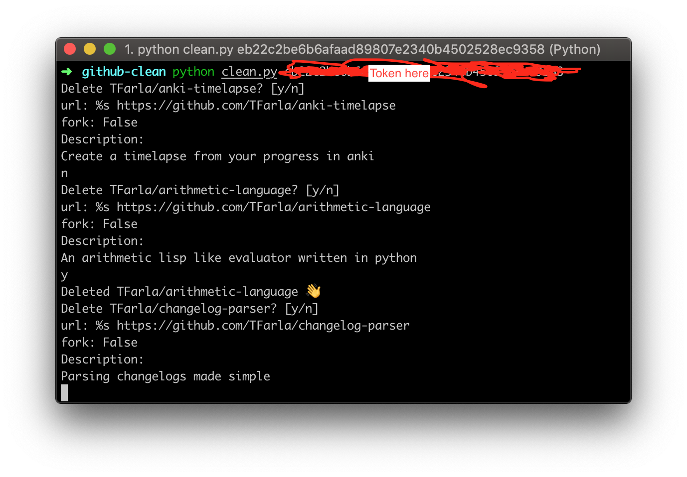

Stupid, simple cli tool to bulk delete github repositories



# Why
I had way too many projects on my github profile that I wasn't paying any attention to.

# Obtaining token
Login and create a new access token with the following permissions:

- public_repo
- delete_repo

https://github.com/settings/tokens/new

# Running the app

Make sure [python3](https://www.python.org/downloads/) is installed on your machine

```sh
pip install -r requirements.txt
python clean.py <token>
```

# Contribution

Feel free to create an issue and vey specific so maybe just fork it and fix it yourself.